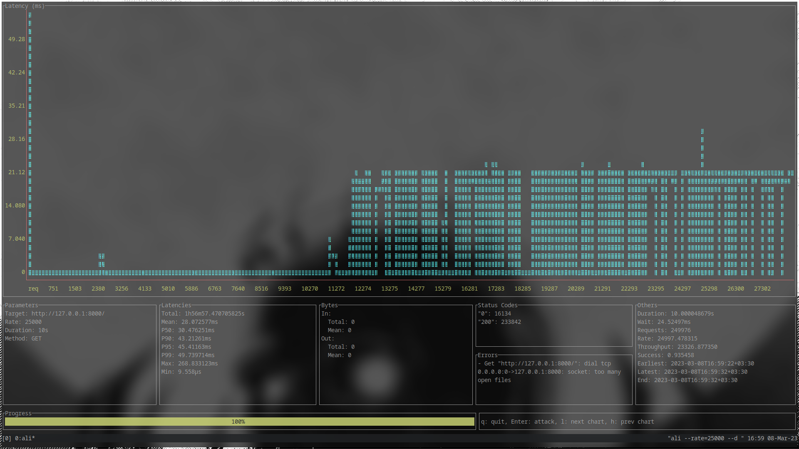
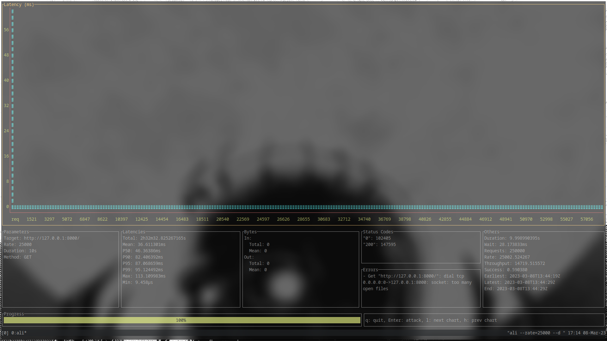
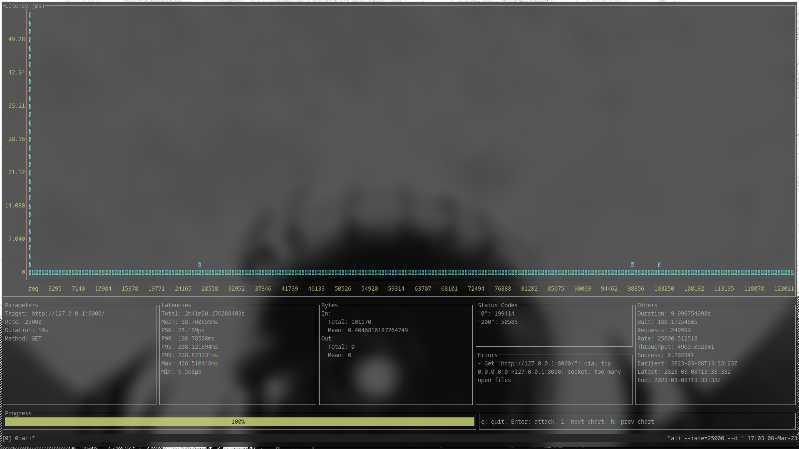
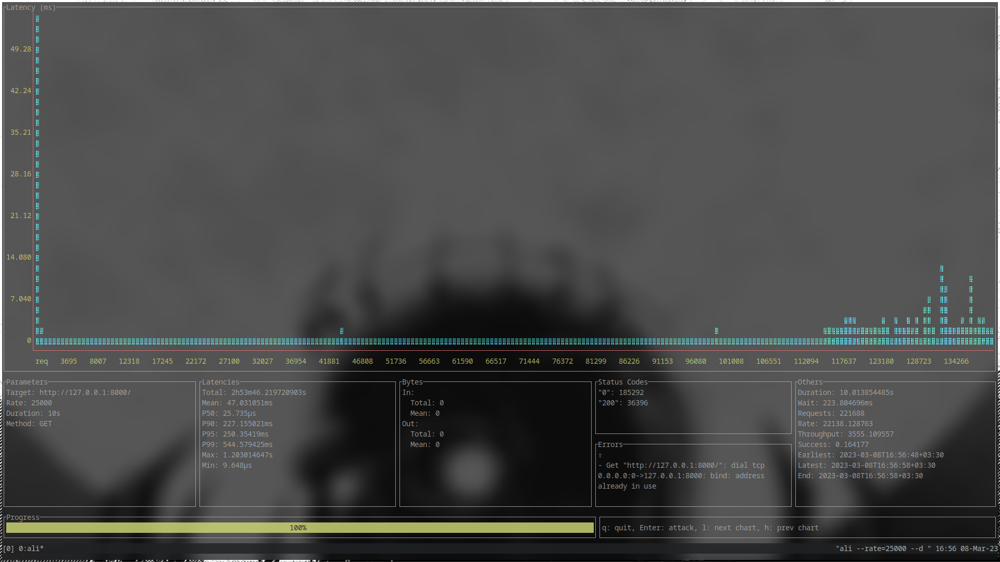
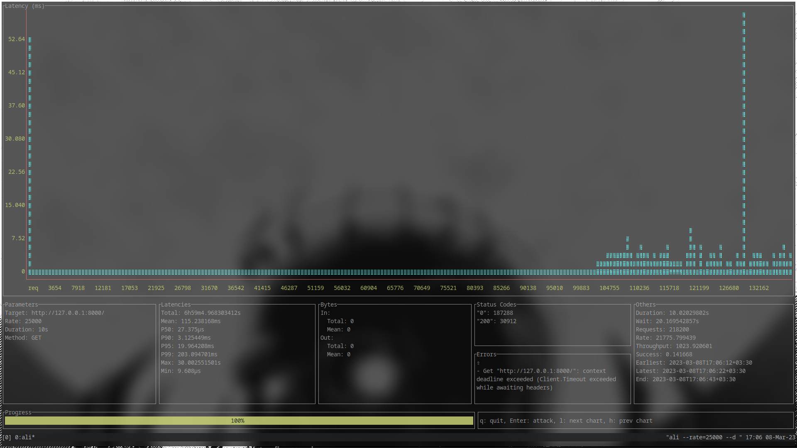
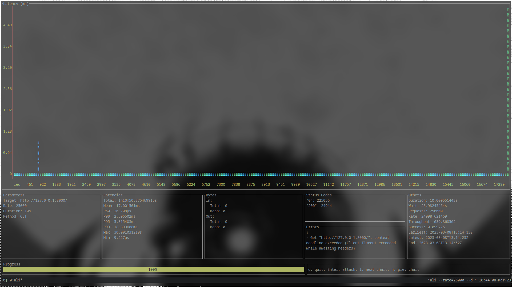

## Benchmark

| Framework  | Throughput  | Request Handled  | Max Latencies |
|------------|-------------|------------------|---------------|
| Sanic      | 23,326      | 233,842          | 268.8ms       |
| Panther    | 14,719      | 147,595          | 113.1ms       |
| FastAPI    | 14,573      | 146,467          | 155.1ms       |
| Tornado    | 4,969       | 50.585           | 426.5ms       |
| Flask      | 3,555       | 36,396           | 1.2s          |
| Django     | 2,188       | 22,814           | 526.3ms       |
| Bottle     | 1,226       | 39,650           | 30.0s         |
| Pyramid    | 1,023       | 30,912           | 30.0s         |
| Cherrypy   | 639         | 24,944           | 30.0s         |

###  All tests happen in 
- CPU: AMD Ryzen 9 5900HX with Radeon Graphics (16) @ 3.300GHz
- OS: Arch Linux x86_64
- KERNEL: 6.2.2-arch1-1

## Results
- ### Sanic
    [[Test Source Code]](https://github.com/AliRn76/panther/tree/master/docs/docs/benchmarks/sanic)
    
    

- ### Panther

    [[Test Source Code]](https://github.com/AliRn76/panther/tree/master/docs/docs/benchmarks/panther)
    
    

- ### FastAPI

    [[Test Source Code]](https://github.com/AliRn76/panther/tree/master/docs/docs/benchmarks/fastapi)
    
    

- ### Tornado
    
    [[Test Source Code]](https://github.com/AliRn76/panther/tree/master/docs/docs/benchmarks/tornado)
    
    

- ### Flask

    [[Test Source Code]](https://github.com/AliRn76/panther/tree/master/docs/docs/benchmarks/flask)
    
    

- ### Django

    [[Test Source Code]](https://github.com/AliRn76/panther/tree/master/docs/docs/benchmarks/django)
    
    

- ### Bottle

    [[Test Source Code]](https://github.com/AliRn76/panther/tree/master/docs/docs/benchmarks/bottle)
    
    

- ### Pyramid

    [[Test Source Code]](https://github.com/AliRn76/panther/tree/master/docs/docs/benchmarks/pyramid)
    
    

- ### Cherrypy

    [[Test Source Code]](https://github.com/AliRn76/panther/tree/master/docs/docs/benchmarks/cherrypy)
    
    
