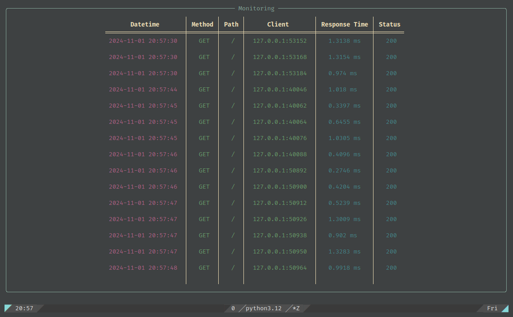

> <b>Variable:</b> `MONITORING` 
> 
> <b>Type:</b> `bool` 
> 
> <b>Default:</b> `False`


Panther log `perf_time` of every request if this variable is `True`

Then you can watch them live with: `panther monitor`

Make sure it is `False` on production for better performance

It's using `monitoring` logger


#### Reference 
- [panther.monitoring.Monitoring](https://github.com/AliRn76/panther/blob/master/panther/monitoring.py)

#### Log Example

```python
date time | method | path | ip:port | response_time(seconds) | status

2023-12-11 18:23:42 | GET | /login | 127.0.0.1:55710 | 0.001117052001063712 | 200
```


#### Monitoring Example

